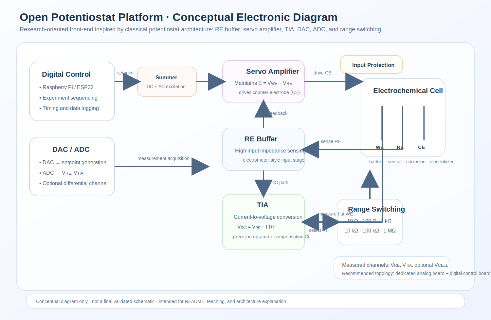

# Open Potentiostat Platform

Open electrochemical instrumentation platform for **research** and **master-level teaching** using a hybrid **ESP32 + Raspberry Pi** architecture.

<p align="center">
  
</p>

<p align="center">
  <em>Hybrid architecture separating real-time control (ESP32) and high-level processing (Raspberry Pi).</em>
</p>

---

## Overview

This repository contains the foundations of a modular open potentiostat platform designed for:

* **research validation and comparison** against commercial instruments
* **master-level teaching** in electrochemistry, instrumentation, embedded systems, and data acquisition
* **project-based learning** for laboratory courses, MSc theses, and research prototypes

The platform is based on three main layers:

* **ESP32** for embedded experiment control
* **Raspberry Pi** for host-side control, plotting, and data logging
* **Analog front-end** for electrochemical interfacing, including RE buffering, servo control, and TIA current measurement

---

## Research Goals

* Develop a **low-cost potentiostat platform**
* Validate the system against **commercial equipment** such as the **Gamry Reference 600**
* Enable reproducible workflows for:

  * battery characterization
  * electrolyzer diagnostics
  * sensor development
  * corrosion-related experiments
* Provide an extensible base for future techniques such as **EIS**

---

## Teaching Goals

This project is also intended for **master-level courses** in:

* electrochemistry
* electronic instrumentation
* embedded systems
* data acquisition and signal processing

Typical learning objectives include:

* understanding the roles of **WE, RE, and CE**
* studying the operation of a potentiostat control loop
* analyzing the function of:

  * the **reference buffer**
  * the **servo amplifier**
  * the **transimpedance amplifier (TIA)**
* implementing and interpreting:

  * **chronoamperometry (CA)**
  * **cyclic voltammetry (CV)**
  * introductory **electrochemical impedance spectroscopy (EIS)**

---

## System Architecture

### Main blocks

* **Raspberry Pi**

  * experiment configuration
  * CSV logging
  * plotting and GUI
  * calibration and post-processing

* **ESP32**

  * real-time experiment sequencing
  * DAC control
  * ADC acquisition
  * relay/range switching
  * safety checks and data streaming

* **Analog Front-End**

  * high-impedance RE buffer
  * servo amplifier for CE drive
  * TIA current measurement at WE
  * input protection and current range selection

* **Electrochemical Cell**

  * WE (Working Electrode)
  * RE (Reference Electrode)
  * CE (Counter Electrode)

---

## Conceptual Electronic Diagram

<p align="center">
  
</p>

<p align="center">
  <em>Conceptual analog front-end including RE buffer, servo amplifier, TIA current measurement, DAC/ADC interface, and electrochemical cell.</em>
</p>

---

## Repository Structure

```text
open-potentiostat-platform/
├── docs/
├── hardware/
├── firmware/
├── software/
├── protocols/
├── examples/
├── data/
├── images/
└── .github/
```

### Key folders

* `docs/` → project documentation, teaching material, research notes
* `hardware/` → analog front-end, control board, KiCad files
* `firmware/esp32/` → embedded code for experiment control
* `software/raspberry/` → Python host tools
* `protocols/` → serial JSON protocol
* `examples/` → electrochemical experiments and usage examples
* `data/` → sample datasets and future validation results
* `images/` → diagrams and figures used in documentation

---

## Quick Start

### 1. Hardware

Build or adapt:

* analog front-end board
* ESP32 control board
* Raspberry Pi host

### 2. Firmware

Use PlatformIO for the ESP32 firmware:

```bash
cd firmware/esp32
pio run
pio run -t upload
pio device monitor
```

### 3. Raspberry Pi Host

Install Python dependencies and run the host tools:

```bash
cd software/raspberry
pip install -r requirements.txt
python example_run.py
```
## 🧪 Experiments

- [Chronoamperometry Practice](docs/experiments/chronoamperometry.md)
- [Cyclic Voltammetry Practice](docs/experiments/cyclic_voltammetry.md)

## 📡 Communication

- [Serial Protocol Examples](protocols/serial_protocol_examples.md)
---

## Communication Protocol

Communication between Raspberry Pi and ESP32 is based on a **lightweight JSON protocol** over serial.

Example command:

```json
{"cmd":"start_ca","set_voltage":1.2,"duration_s":10,"range":"10uA","dt_ms":20}
```

Example streamed data:

```json
{"type":"data","t_ms":100,"v_cmd":1.2,"v_re":2.10,"v_tia":2.48,"e_we":0.40,"i_a":2e-7,"range":"10uA"}
```

See:

```text
protocols/serial-json-protocol.md
```

---

## Current Status

This repository is a **starter framework** and not yet a fully validated scientific instrument.

Already included:

* repository structure
* research and teaching documentation skeleton
* ESP32 firmware starter
* Raspberry Pi host starter
* serial JSON protocol draft
* architecture diagrams

Planned next steps:

* real ADC/DAC integration
* validated analog front-end design
* auto-ranging
* saturation detection
* calibration workflow
* GUI integration
* EIS support

---

## Validation Strategy

The long-term validation plan includes comparison against commercial instruments, especially the **Gamry Reference 600**, using:

* potential accuracy
* current accuracy
* repeatability
* noise floor
* CA transient agreement
* CV curve agreement

See:

```text
docs/research/validation-against-gamry.md
```

---

## Safety Notice

This project is intended for **laboratory development and teaching only**.

It is **not** a certified instrument.

Before use, validate:

* loop stability
* voltage and current limits
* grounding strategy
* input protection
* measurement repeatability
* safe operating conditions of the electrochemical cell

See:

```text
docs/safety.md
```

---

## Roadmap

* **v0.1**: basic CA workflow
* **v0.2**: basic CV workflow
* **v0.3**: current range switching and saturation handling
* **v0.4**: calibration workflow
* **v0.5**: Raspberry Pi GUI integration
* **v1.0**: introductory EIS support

---

## Contributing

Contributions are welcome in:

* analog hardware design
* firmware
* Raspberry Pi software
* documentation
* teaching materials
* validation workflows

Please read:

```text
CONTRIBUTING.md
```

---

## License

This repository currently includes the **MIT License** for software content.

If the hardware section evolves into a full open hardware release, licensing may be refined accordingly.

---

## Citation

If you use this project in teaching, reports, theses, or publications, please cite it using:

```text
CITATION.cff
```

---

## Vision

The long-term goal is to create an **open, accessible, and academically useful alternative** to commercial potentiostat platforms, supporting both:

* **transparent electrochemical research**
* **hands-on advanced engineering education**
