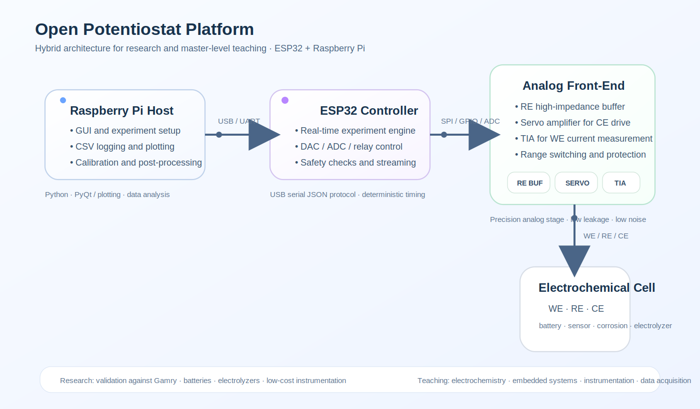

# 🧪 Cyclic Voltammetry Laboratory Practice (Master Level)

## Overview

This laboratory session introduces **cyclic voltammetry (CV)** using the Open Potentiostat Platform.

Students will apply a **triangular potential waveform** and analyze the resulting **current–potential response**, linking the experimental curve to electrochemical processes, instrumentation limits, and scan-rate effects.

---

## 🎯 Learning Objectives

- Understand the principle of cyclic voltammetry
- Interpret a voltammogram \( I(E) \)
- Distinguish oxidation and reduction processes
- Study the effect of scan rate
- Relate the measured response to diffusion, kinetics, and instrumentation

---

## ⚙️ Experimental Setup

### Instrumentation
- Open Potentiostat Platform (ESP32 + Raspberry Pi)
- Analog front-end with:
  - RE buffer
  - servo amplifier
  - transimpedance amplifier (TIA)
- Host software for acquisition and plotting

### Electrochemical Cell
- Working Electrode (WE)
- Reference Electrode (RE)
- Counter Electrode (CE)

---

## 🔌 System Architecture

<p align="center">
  
</p>

---

## ⚡ Experimental Principle

In cyclic voltammetry, the applied potential is swept linearly with time:

\[
E(t) = E_{start} 
ightarrow E_{vertex1} 
ightarrow E_{vertex2}
\]

The current is recorded as a function of potential:

\[
I = I(E)
\]

The resulting curve is called a **voltammogram**.

---

## 📉 Typical CV Response

A reversible redox system often shows:

- an oxidation peak on the forward scan
- a reduction peak on the reverse scan

Conceptually:

```text
I
│          /│         /  │        /    \__
│_______/        \____
│       \        /
│        \__    /
│           \  /
│            \/
└──────────────────── E
```

---

## 🧠 Physical Interpretation

### Oxidation peak
As the potential reaches the oxidation region, the current rises due to electron transfer.

### Peak decay
After the peak, the current decreases because the concentration of electroactive species near the electrode surface is depleted.

### Reduction peak
On the reverse scan, the opposite redox process may appear, generating a reduction peak.

---

## 🧪 Experimental Procedure

1. Connect WE, RE, and CE
2. Select **Cyclic Voltammetry** mode
3. Define:
   - start potential
   - upper vertex potential
   - lower vertex potential
   - scan rate
4. Record at least 3 voltammograms
5. Repeat for at least two scan rates

### Suggested Parameters

| Parameter | Suggested value |
|---|---:|
| Start potential | 0.0 V |
| Vertex 1 | 1.0 V |
| Vertex 2 | -0.2 V |
| Scan rate | 0.02–0.10 V/s |
| Cycles | 1–3 |

---

## 📊 Data Analysis

### 1. Plot \( I(E) \)
This is the main voltammogram.

### 2. Identify:
- anodic peak potential
- cathodic peak potential
- anodic peak current
- cathodic peak current

### 3. Compare scan rates
Observe how:
- peak current changes
- peak shape evolves
- separation between peaks may vary

---

## 📈 Expected Trends

For diffusion-controlled systems, peak current often increases with scan rate approximately as:

\[
I_p \propto \sqrt{v}
\]

where:
- \( I_p \) = peak current
- \( v \) = scan rate

---

## ❓ Questions

1. Why does the current show a peak instead of increasing indefinitely?
2. What is the difference between oxidation and reduction peaks?
3. How does scan rate affect peak current?
4. What indicates reversibility in a voltammogram?
5. Which instrumental limitations can distort the CV curve?

---

## ⚠️ Instrumentation Considerations

- current range selection
- DAC resolution
- ADC sampling rate
- loop stability
- TIA saturation near peaks
- noise at low currents

---

## 🔬 Advanced Tasks (Optional)

- Compare multiple scan rates
- Estimate peak separation
- Study the influence of current range
- Compare with a commercial potentiostat
- Analyze a simple reversible redox system

---

## 📁 Suggested Data Format

```csv
time_s,potential_v,current_a
0.000,0.00,1.2e-6
0.050,0.01,1.8e-6
0.100,0.02,2.7e-6
```

---

## 📌 Conclusion

Cyclic voltammetry is one of the most important electrochemical techniques for:

- identifying redox behavior
- studying reversibility
- understanding transport and kinetics
- validating the performance of a potentiostat platform

It is especially valuable in both **research** and **master-level teaching**.
